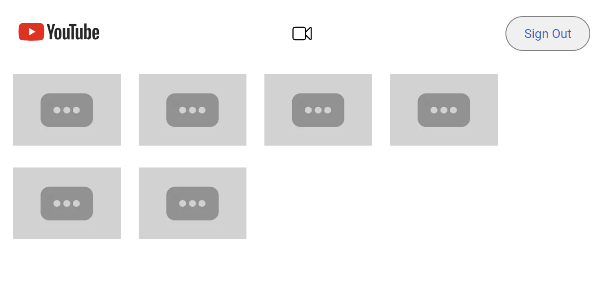
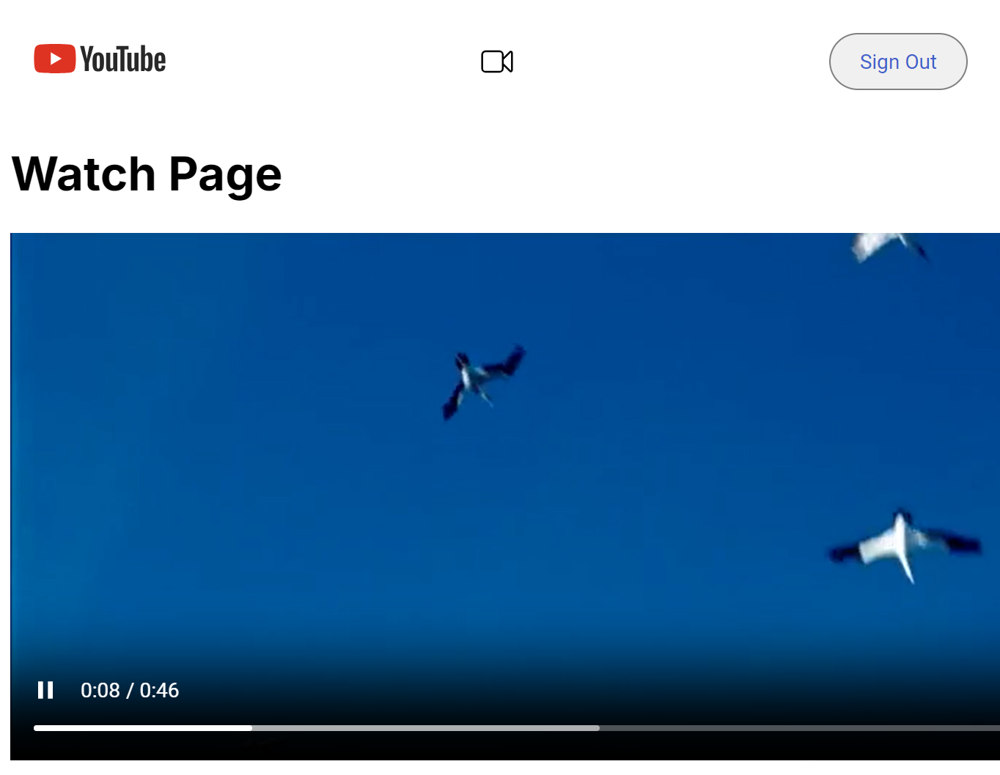
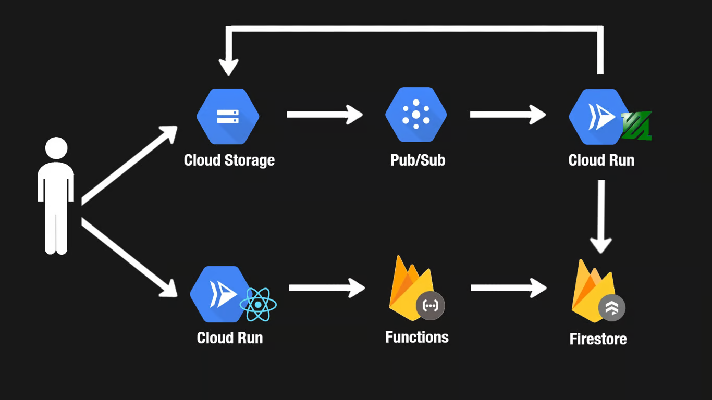

# YouTube-Clone
This is a a simplified clone of YouTube that I built by following along with [Neetcode's Full Stack Development course.](https://neetcode.io/courses/full-stack-dev/0). Through this course I learned how to create a Full Stack web app and the principals necessary to create another in the near future. Most importantly how each of the moving parts come together to create one app. You can view my current version [here.](https://yt-web-client-55681089710.us-central1.run.app/)

Upon loading the website the user is greeted with a homepage which features a sign in button and links (via clicking the thumbnail) to the 10 most recent videos. Upon clicking the "sign in" button the user will be prompted to sign in with their Google account. Once verified an upload button will appear where the user can upload a video for any user to view. Once uploaded, the video is downloaded and is converted to 360p by my Video-Processing-Service. Once processed the video is uploaded to my app or any user to enjoy.

<b>Future Work:</b>
<ul>
  <li>Allow users to upload titles and name their videos.</li>
  <li>Implement the automatic cleanup of raw videos from Cloud Storage.</li>
  <li>Allow users to upload multiple videos without having to refresh the page.</li>
</ul>

## Signed Out View

## Signed In View

## Watch Page View

## OverView

## Tech Stack
<ul>
  <li><b>Web Client:</b> Next.js hosted on Cloud Run.</li>
  <li><b>Video Storage</b>: Google Cloud Storage.</li>
  <li><b>Event Handling:</b> Cloud Pub/Sub.</li>
  <li><b>API:</b> Firebase functions.</li>
  <li><b>Authentication:</b> Firebase Auth.</li>
</ul>
